# Enable Ethernet-WiFi Bridge

> "Wireless Made Easy!" - This example application bridge the LAN and Wireless LAN on a single and same sub network

Devices: **WFI32E01 | LAN8720**

**Watch the video and see how to enable L2 Bridging function with WFI32E Curiosity board**

<a href="https://youtu.be/W9FOUlL607k" target="_blank">
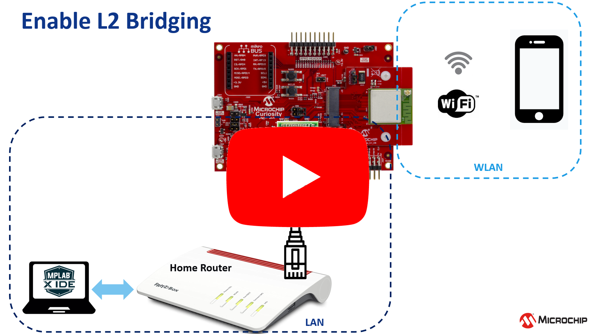</a>

## ⚠ Disclaimer

<b>
THE SOFTWARE ARE PROVIDED "AS IS" AND GIVE A PATH FOR SELF-SUPPORT AND SELF-MAINTENANCE.  
This repository contains unsupported example code intended to help accelerate client product development. It is not validated for production nor audited for security best-practices.  
Note that while this repository is unsupported, Microchip welcome community contributions, and all pull-requests will be considered for inclusion into the repository.

</b>

> Interact with peers in the community at [WiFi Forum](https://www.microchip.com/forums/f545.aspx).

## Description

From [wikipedia](https://en.wikipedia.org/wiki/Bridging_(networking)), the network bridging is a function that creates a single, aggregate network from more than two communication networks.

Routing and bridging are often misinterpreted as the same function. Routing function allows more than two networks to communicate while remaining as separate/independent networks. Whereas, bridging function connects two separate networks as if they were a single network. 

In the OSI model, bridging is performed in the data link layer (layer 2).

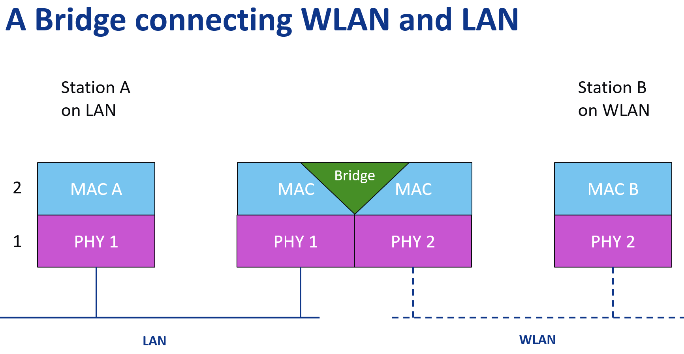

Bridging is independent of IP addresses. With one or more wireless segments in the bridged network, the device can be called a wireless bridge. 

Below are the key points to consider while creating a bridging project:
* The bridge knows only MAC addresses and doesn't know anything else
* The bridge nver forwards a packet back to the interface the packet came from to avoid loops
* If the packet destination (MAC) address is multicast or broadcast, the packet will be forwarded on all the other interfaces
   * It will be passed internally to the stack running on top of the bridge too for internal processing
* If the packet destination is unicast:
   * If it is an address of one of the interfaces on the bridge host, the packet will be passed for internal processing
   * If it is the address of a host that the MAC bridge knows about, then the packet will be forwarded only on that interface
      * The bridge knows where various hosts are by looking at the source MAC address of the incoming packets
   * Otherwise it will be forwarded on all interfaces

## Software requirement

PIC32MZW1 can be used as a Wireless Bridge connecting multiple wireless and wired networks to form a single network.

The bridging functionality can be enabled or disabled using MPLAB Harmony Configurator (MHC) with the NET repo (3.7.1 or above) and wireless_wifi repo (3.4.0 or above).

The sample project has been created and tested with the following Software Development Tools:
- MPLAB X IDE v6.00
- MPLAB XC32 v3.01
- MPLAB Harmony v3.6.4
   - mhc v3.8.2
   - csp v3.10.0
   - core v3.10.0
   - wireless_wifi v3.6.1
   - dev_packs v3.10.0
   - wireless_system_pic32mzw1_wfi32e01 v3.6.1
   - wolfssl v4.7.0
   - net v3.7.4
   - crypto v3.7.5
   - CMSIS-FreeRTOS v10.3.1

## Hardware setup using the WFI32 Curiosity Board

- Computer connected to [WFI32 Curiositiy board](https://www.microchip.com/DevelopmentTools/ProductDetails/PartNO/EV12F11A) over USB POWER (J204)
- J202 = VBUS
- J301 = open

USB-to-UART cable between the computer and GPIO Header UART1 pins (Rx, GND, Tx) to observe the console logs.

- PIC32 LAN8720 PHY Daughter Board [AC3200043-3](https://www.microchip.com/DevelopmentTools/ProductDetails/AC320004-3) plugged in WFI32 Cursiotiy Board thru J208

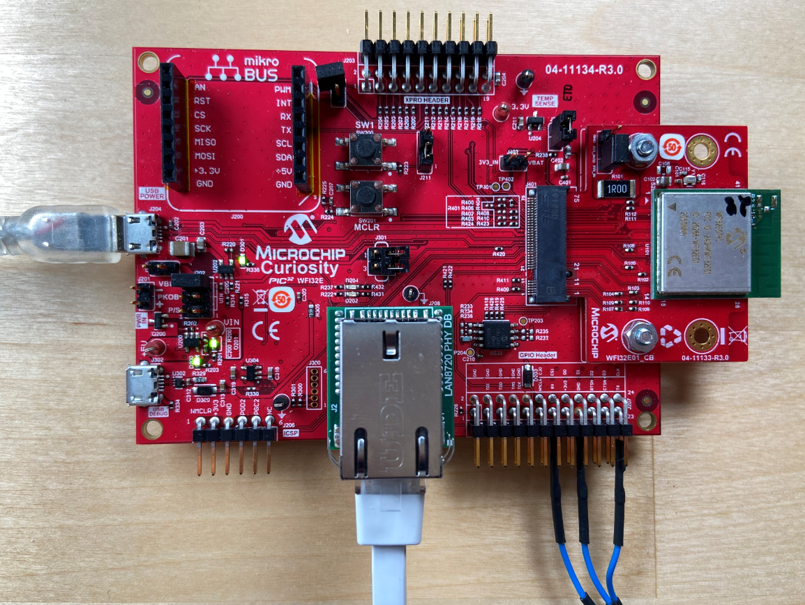

- An Ethernet cable between PHY Daughter board and the Home Router

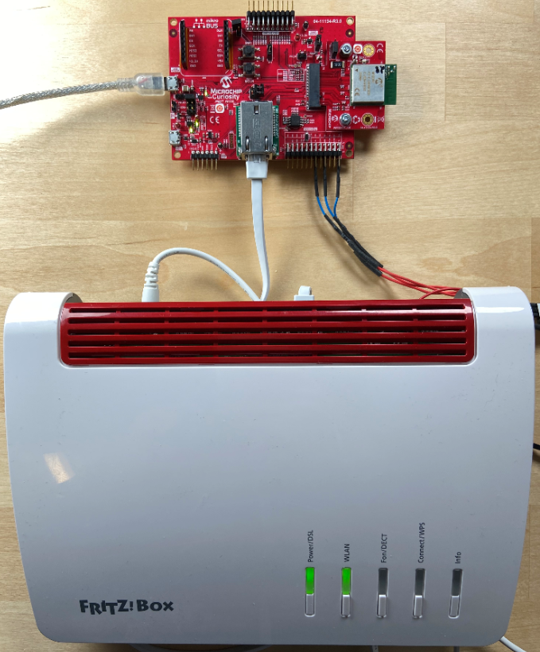

## MHC Configuration

* Open the project [WiFi-ethernet dual interface](https://microchip-mplab-harmony.github.io/wireless/apps/wifi_eth_dual_interface/readme.html) located in `<HarmonyFrameworkFolder>/wireless/apps/wifi_eth_dual_interface` with MPLAB X IDE

* Open Harmony Configurator

* Under **Project Graph > Root**, set the AP parameters required for a station device to connect to the Bridge in **WiFi Service**

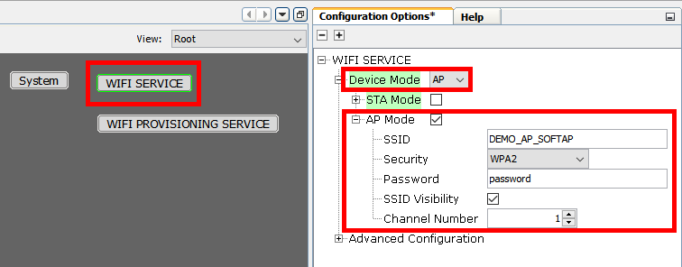

* Under **Project Graph > APPLICATION LAYER**:
   * Select **DHCP Server**
   * Untick **DHCP Server Instance 0** box

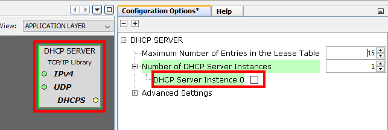

* Under **Project Graph > APPLICATION LAYER**:
   * Select **TCP/IP Application Layer Configuration**
   * Add **DHCP CLIENT** and **DNS CLIENT** components
   * Remove **DHCP Server** 

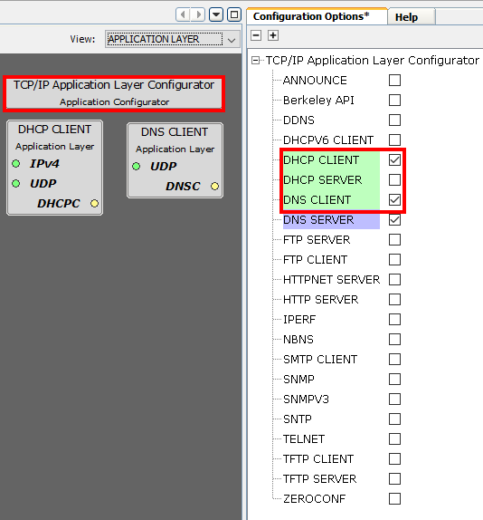

* Under **Project Graph > System Configuration**, make sure the Ethernet and the WiFi MAC instances are enabled in the **NETCONFIG** component

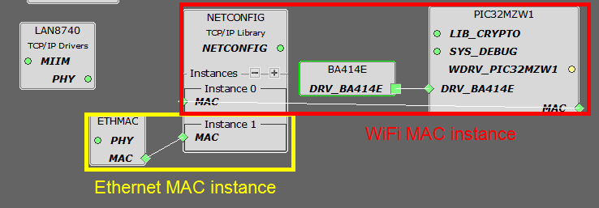

* Select the **ETHMAC** component, expand **Ethernet Rx Filters Selection** and check **Accept Not Me Unicast Packets** to enable the promiscuous mode

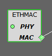
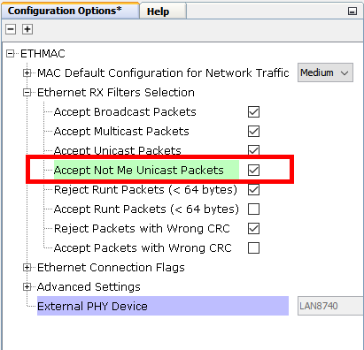

* Select the **MAC Instance 0** from the **NETCONFIG** component 
   * Make sure **IPv4 Static Address** = 0.0.0.0
   * Disable **DHCP Flag**, **DNS Flag** and **Multicast** under **Network Configuration Start-up Flags**
   * Enable **Add Interface to MAC Bridge** under **Advanced Settings**

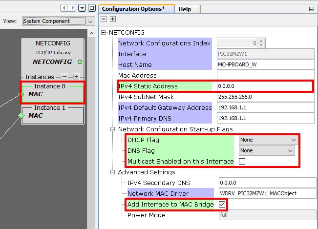

* Select the **MAC Instance 1** from the **NETCONFIG** component
   * Make sure **IPv4 Static Address** = 0.0.0.0
   * Enable **DHCP Flag** and **DNS Flag** under **Network Configuration Start-up Flags**
   * Enable **Add Interface to MAC Bridge** under **Advanced Settings**

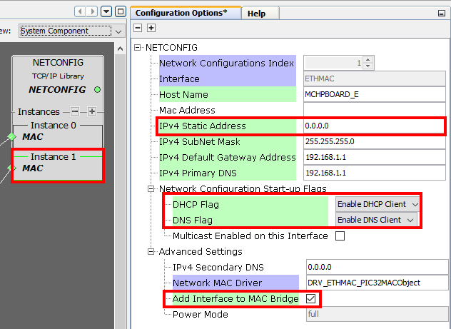

* Select the **NETCONFIG** component and check **Enable the MAC Bridge Commands**

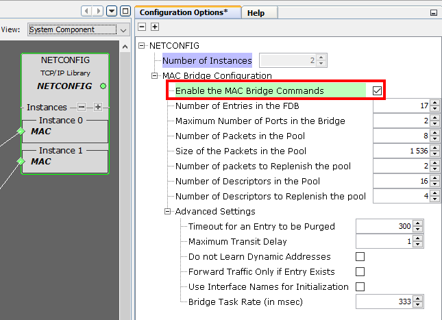

* Generate the code

> With the above settings, the WFI32 is now ready to work as a Wi-Fi Network bridge

## Try it

1. Build and program the code
2. Plug the Ethernet cable from the PHY Daughter board to your own Home Router
3. Reset the WFI32E Curiosity board

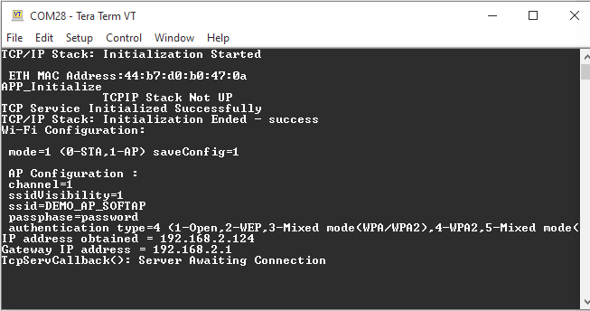

4. Connect a station in Wireless to the WLAN network created by the WFI32 device in SoftAP mode

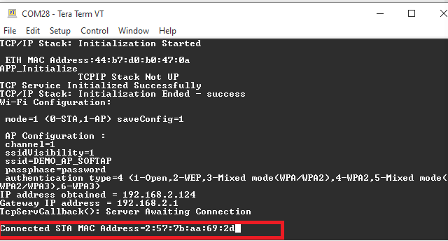

5. To evaluate performance, open iPerf server on a station connected to the Home router thru Ethernet cable

Get the IP address of the server
`> ipconfg`

Run iperf server
`> iperf3 -s`

6. On client side, open iPerf apps or execute `> iperf3 -c <ipaddress of the server>` command from a console

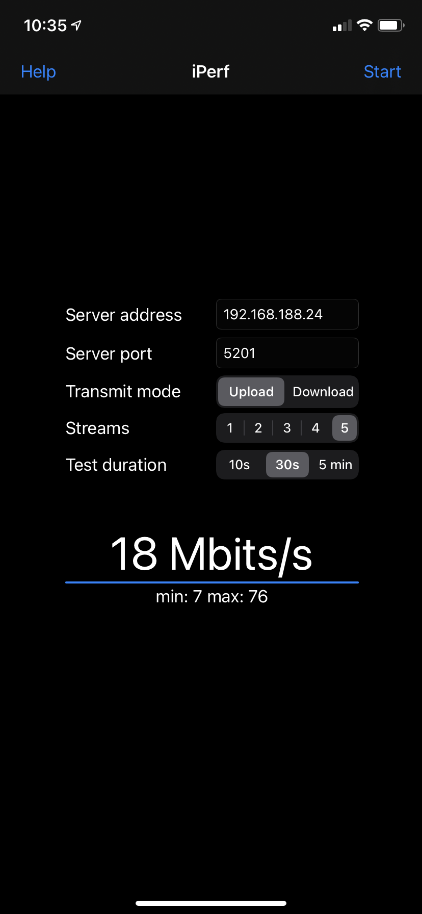
.............................................
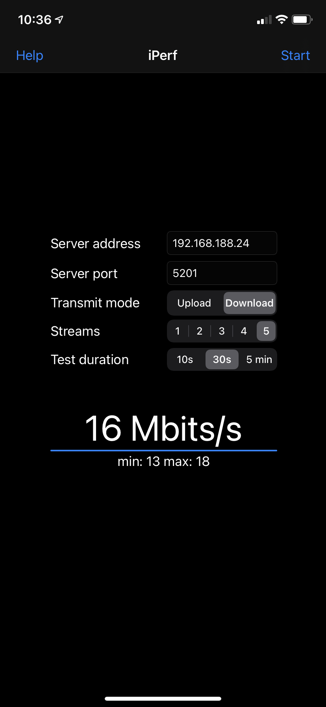

